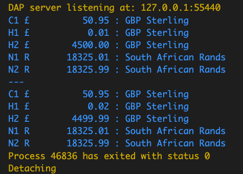

# sandbox currency and Money types

Messy experiment playing with types and interfaces, and experiment with currency (Money) types

#### Creating currency objects

```go
zar1 := money.NewZAR(18325.01)
zar2 := money.NewZAR(18325.99)
gbp1 := money.NewGBP(50.95))
```

#### Comparing

`.Greater()`, `.GreaterThan()`, `.Equal()`, `.LessThan()` etc

```go
if zar1.Greater(zar2) {
    ...
}
```

#### Printing

```go
fmt.Println("|", gbp1.Wide(), "|")
fmt.Println("|", gbp1.Narrow(), "|")
```

**_produces_**

Standard 14 and 7 digit wide columnformats respectively.

```dos
| £          50.95 |
| £   50.95 |
```

#### Cloning with new Value

Clone the currency type and formatting;

```go
gbp2:= gbp1.Clone(123.45)
```

#### type safety

You can't add or substract different currency types. Compiler will prevent that.

#### Small account service created using the currency types

Example code can be run as follows

```go
func TestAccountService() {
	as := accountservice.New("accounts.json")
	as.CreateAccount("H1", "Harrys account", money.NewGBP(0.01))
	as.CreateAccount("H2", "Haggard account", money.NewGBP(4500))
	as.CreateAccount("N1", "Nelly account1", money.NewZAR(18325.01))
	as.CreateAccount("N2", "Nelly account2", money.NewZAR(18325.99))
	as.CreateAccount("C1", "Chandler account", money.NewGBP(50.95))
	as.Dump()
	fmt.Println("---")
	as.Transfer("H2", "H1", money.NewGBP(0.01))
	as.Dump()
}

```

Produces the following output



#### Adding additional currencies

In order to get type safety (without code generation or generics) you need to implement (add) 1 new file per additional currency and implement the following reciever methods. **_ example below is from `gbp.go` _**

```go
package money

import "fmt"

// GBP money
type GBP struct{ Money }

// NewGBP returns a NewGBP money
func NewGBP(amount float64) GBP {
	m := new2DecimalFormatLeft("£", amount)
	return GBP{m}
}

// Add ...
func (m GBP) Add(rhs GBP) Money {
	return m.Clone(m.allDigits + rhs.allDigits)
}

// Subtract ...
func (m GBP) Subtract(rhs GBP) GBP {
	return GBP{m.Money.Clone(m.allDigits - rhs.allDigits)}
}

// GreaterOrEqual ...
func (m GBP) GreaterOrEqual(rhs GBP) bool {
	return m.allDigits >= rhs.allDigits
}

// Greater ...
func (m GBP) Greater(rhs GBP) bool {
	return m.allDigits > rhs.allDigits
}

// Equal ...
func (m GBP) Equal(rhs GBP) bool {
	return m.allDigits == rhs.allDigits
}

// LessThan ...
func (m GBP) LessThan(rhs GBP) bool {
	return m.allDigits < rhs.allDigits
}

// GetMoney ...
func (m GBP) GetMoney() Money {
	return m.Money
}

// Wide ...
func (m GBP) Wide() string {
	return fmt.Sprintf(m.formatWide, m.integralDigits, m.fractionalDigits)
}

// Short ...
func (m GBP) Short() string {
	return fmt.Sprintf(m.formatShort, m.integralDigits, m.fractionalDigits)
}


```

## useful links

-   https://floating-point-gui.de/formats/integer/ : see the note and warning NOT to use integers if at all possible.
-   https://floating-point-gui.de/xkcd/
